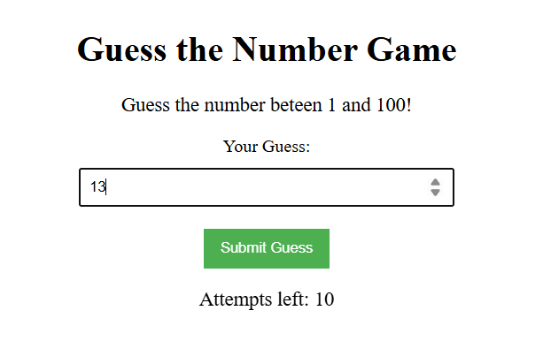
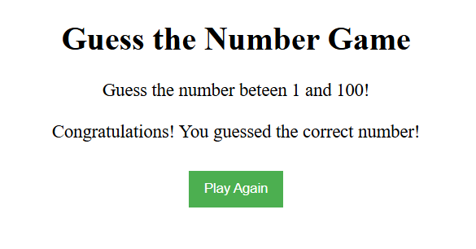
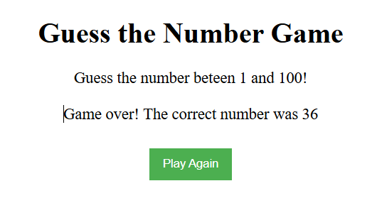

# Angular Guess the Number Game 🎯

This is a fun and interactive number guessing game built using Angular 19. The app randomly selects a number between 1 and 100, and the user has 10 attempts to guess it. Helpful feedback is provided after every guess, and the game can be restarted anytime.

---

## 📸 Screenshot





---

## 🔧 What I Built

I developed a clean and responsive **Guess the Number** component using:

- Angular CLI 19.1.8
- Reactive state management
- Two-way data binding with `[(ngModel)]`
- Conditional UI rendering using `*ngIf`
- Input validation and feedback logic
- Basic SCSS styling with a game-themed layout

---

## 💡 Key Features

- Secret number is randomly generated between 1 and 100
- Users get 10 chances to guess correctly
- Instant feedback: Too high / Too low
- Game over message when all attempts are used
- Victory message on correct guess
- Option to reset the game and play again

---

## 🧱 Technologies Used

- **Angular 19**
- **TypeScript**
- **Standalone Components**
- **HTML & SCSS**
- **FormsModule** for `ngModel`
- **Conditional Rendering** using `*ngIf`
- **Math.random()** and input validation

---

## 📁 Project Structure

```plaintext
src/
├── app/
│   └── guess-the-number/
│       ├── guess-the-number.component.ts       # Game logic and state
│       ├── guess-the-number.component.html     # UI markup
│       ├── guess-the-number.component.scss     # Component styling


## Development server

To start a local development server, run:

```bash
ng serve
```

Once the server is running, open your browser and navigate to `http://localhost:4200/`. The application will automatically reload whenever you modify any of the source files.

